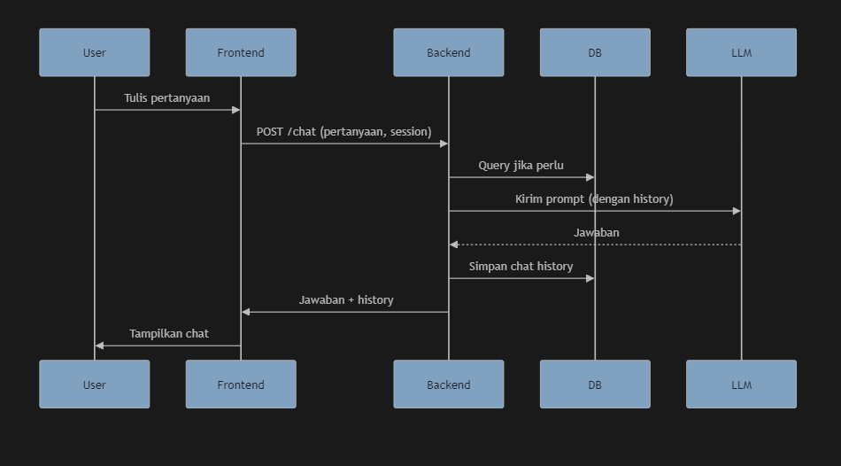

# AI Task Analyst Web

Web AI sederhana untuk menanyakan pertanyaan terkait data tugas/proyek yang ada di database, dengan chat yang mengingat percakapan sebelumnya.

---

## **Contoh Diagram Flow**



---

## **Fitur**
- Chat AI yang mengingat percakapan (session-based)
- AI menjawab berdasarkan data nyata dari database
- Data diambil otomatis dari SQLite (`tasks.db`)
- Frontend ringan (HTML + Vue CDN)
- Logging proses dan error

---

## **Struktur Project**
```
ai-task-analyst/
│
├── app.py                # Backend FastAPI
├── requirements.txt      # Python dependencies
├── .env                  # API key LLM
├── database_task.sql     # SQL schema + data
├── static/
│   └── index.html        # Frontend chat
└── tasks.db              # (auto-generated) SQLite DB
```

---

## **Instalasi & Setup**

### 1. **Clone repo & masuk ke folder**
```bash
git clone <repo-url>
cd ai-task-analyst
```

### 2. **Buat & aktifkan environment (opsional, tapi disarankan)**
```bash
# Contoh dengan conda
conda create -n ai-task python=3.10
conda activate ai-task

# Atau dengan venv
python -m venv venv
venv\Scripts\activate  # Windows
```

### 3. **Install dependencies**
```bash
pip install -r requirements.txt
```

### 4. **Siapkan file `.env`**
Buat file `.env` di root, isi:
```
LLM_API_KEY=your_google_ai_studio_api_key
LLM_API_URL=https://generativelanguage.googleapis.com/v1beta/models/gemini-pro:generateContent?key=your_google_ai_studio_api_key
```
Ganti dengan API key dan endpoint sesuai LLM yang digunakan.

### 5. **Pastikan file `database_task.sql` berisi CREATE TABLE + INSERT**
Sudah ada di repo, tapi pastikan bagian atas file seperti:
```sql
CREATE TABLE IF NOT EXISTS user (...);
CREATE TABLE IF NOT EXISTS task (...);
CREATE TABLE IF NOT EXISTS activity (...);
-- lalu INSERT ...
```

---

## **Menjalankan Aplikasi**

### 1. **Jalankan backend**
```bash
uvicorn app:app --reload
```
- Server akan otomatis membuat file `tasks.db` dari `database_task.sql` jika belum ada.

### 2. **Akses frontend**
Buka di browser:
```
http://127.0.0.1:8000/static/index.html
```

---

## **Troubleshooting & Error Handling**

### **Error: `sqlite3.OperationalError: no such table: user`**
**Penyebab:**
File `tasks.db` sudah ada, tapi kosong/tidak sesuai schema.

**Solusi:**
1. **Hapus file `tasks.db`** di folder project.
2. **Restart server** (`uvicorn app:app --reload`).
   - Server akan otomatis membuat ulang database dari `database_task.sql`.

### **Error: `Import "fastapi" could not be resolved`**
- Pastikan environment sudah aktif.
- Jalankan: `pip install fastapi uvicorn`

### **Error: `uvicorn` not found**
- Jalankan: `pip install uvicorn`

### **Error: LLM tidak menjawab/muncul error API**
- Pastikan `.env` sudah benar dan API key aktif.
- Cek log di `app.log` untuk detail error.

---

## **Catatan Penggunaan**
- Semua data diambil dari database SQLite (`tasks.db`).
- Untuk update data, edit `database_task.sql` lalu hapus `tasks.db` dan restart server.
- Chat history per session disimpan di database.

---

## **Pengembangan Lanjutan**
- Untuk data besar, bisa batasi data yang dikirim ke LLM.
- Bisa ganti LLM ke OpenAI, Ollama, dsb, cukup ganti `.env`.
- Untuk deployment, gunakan server production (misal: `uvicorn app:app --host 0.0.0.0 --port 80`).

---

## **Lisensi**
Bebas digunakan untuk pembelajaran dan pengembangan.

---

**Jika ada error lain, cek log `app.log` atau tanyakan di sini!**